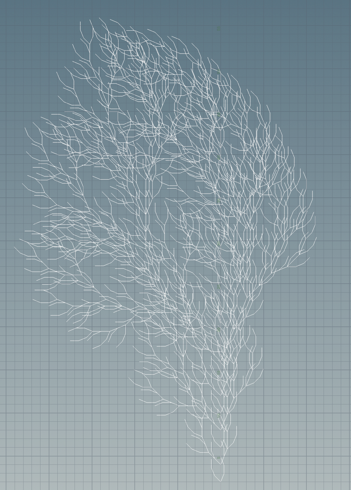

# NPRG031 - L Systems

**Term Project**

- Author: Vojtěch Pröschl
- Supervisor: [Mgr. Pavel Ježek, Ph.D.](https://d3s.mff.cuni.cz/legacy/~jezek/)

---

### Abstract

Main resources: [The Algorithmic Beauty of Plants](http://algorithmicbotany.org/papers/#abop) and [Wikipedia](https://www.wikipedia.org)

## User Documentation

### About L-Systems

The concrete L-System type that is supported by the program is called `Bracketed OL-system`, as described in the [The Algorithmic Beauty of Plants](http://algorithmicbotany.org/papers/#abop) at the page 26. To be more precise `OL-System` is combination of `DOL-System` with a support for stack operations for the turtle state.

Rules in the system are essentially the same as in [Context Free Grammar](https://en.wikipedia.org/wiki/Context-free_grammar), besides the fact that `DOL-Systems` don't differentiate between terminal and non-terminal symbols. We can consider ASCII symbols to be alphabet of this grammar.

Rules have the following form
$$
\mathrm{AllowedRuleTypes}=\{A\to \alpha:A\in \Sigma \wedge \alpha \in \Sigma^*\}
$$
where
$$
\Sigma=\mathrm{ASCIISymbols} \setminus \{';','\,'\}
$$
Also in the entire system, there can be at most single rule for each symbol.

Derivation process works as follows:

- For each symbol in sentence:
  - Apply rule if it exists, otherwise apply identity

This entire process is done $n$ times, where $n$ is user selected constant, that I call `Step Count` in this project.

### About Turtle Interpretation of Strings

The most common way to use strings generated by L-Systems to generate geometry is turtle interpretation. The main idea is to use use "turtle", which is entity, that lives in the 3D space, that can move forward, draw lines and rotate in various directions. For more information about turtle interpretation please refeer to the book [The Algorithmic Beauty of Plants](http://algorithmicbotany.org/papers/#abop). Turtle model is described in detail on pages 6, 19 and 24. My model works exactly as described in the book.

Turtle in the model has two underlying variables:

- $\delta$ - distance that the turtle should travel when moving forward
- $\alpha$​ - the angle by which the turtle should rotate

And has support for the following symbols:

`F` - Move forward and draw a line

`f` - Move forward without drawing a line

`+` - Turn left

`-` - Turn right

`&` - Pitch down

`^` - Pitch up

`\ ` - Roll left

`/` - Roll right

`|` - Turn around

`[` - Push turtle state to stack

`]` - Pop turtle state from stack and set is as current state

### Instructions

The program has text-based user interface. Here is a complete list of instructions available:

- `help`
  - Lists available instructions
- `templates`
  - Lists available templates
- `template [template name]`
  - Configures the generator according to certain template
  - Available templates are listed in the following section
- `display current configuration`
  - Displays current configuration of the generator
- `derive sentence`
  - Uses current configuration to derive sentence
- `display derived sentence`
  - Displays most recently derived sentence
- `clear configuration`
  - Clears configuration of the generator
- `set axiom [axiom]`
  - Sets initial symbol of the grammar to `[axiom]`
- `add rule [{CHAR}->{STRING}]`
  - Adds rule to the generator
  - If rule for that character alredy exists, this command redefines it
- `load configuration [{filename}.txt]`
  - Loads configuration of the generator from text file
  - The exact format is described in the input section
- `set step count [step count]`
  - Sets number of steps in the derivation process
- `save turtle interpretation [{filename}.obj]`
  - Interprets the most recently derived sequence using turtle interpretation and generates .obj file using the data
- `save derived sentence [{filename}.txt]`
  - Saves most recently derived sentence to textfile

### Templates

#### `KochSnowflake`

#### `KochIsland`

#### `HilbertCurve2D`

#### `HilbertCurve3D`

#### `Tree2D`

#### `Tree3D`

### Input

### Output

## Programming Documentation

## Turtle Instructions

distance and angle must be positive

todo make rules of lsystem private again for getter

mention prohibited symbols ... ';' and' '

### Available commands
- `help`
- `display current configuration`
- `derive sentence`
- `display derived sentence`
- `clear configuration`
- `set axiom [axiom]`
- `add rule [rule]`
- `load configuration [file]`
- `set step count [step count]`
- `save turtle interpretation [file]`
- `save derived sentence [file]`